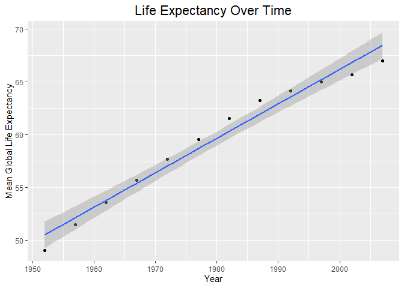
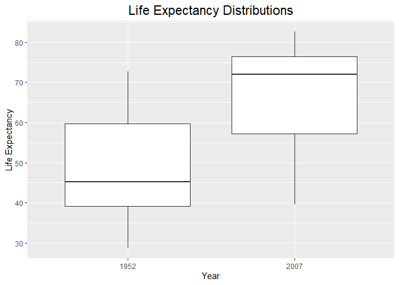
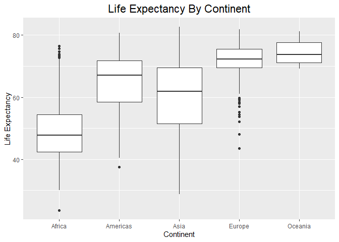
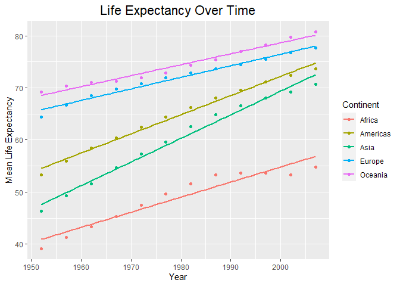
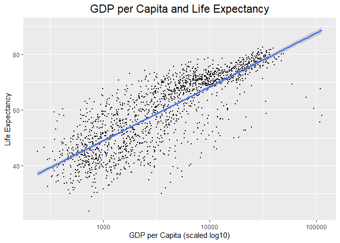
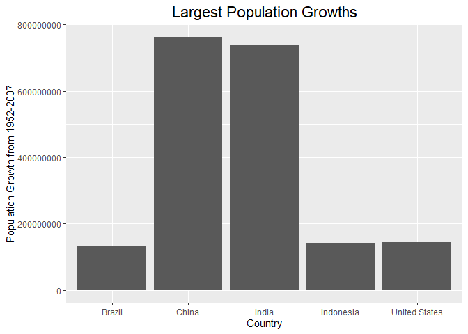
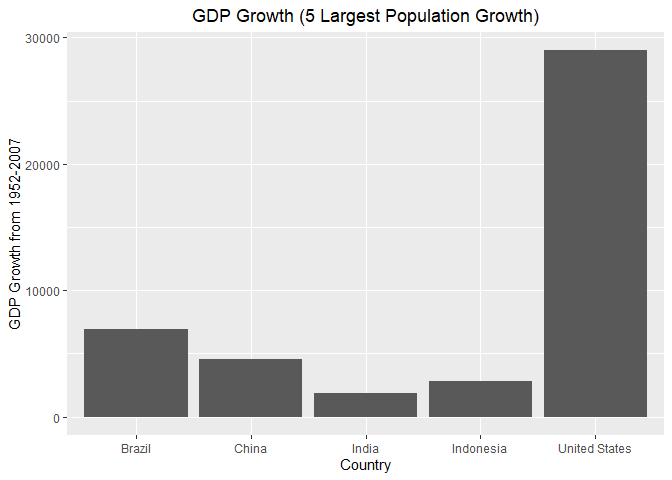
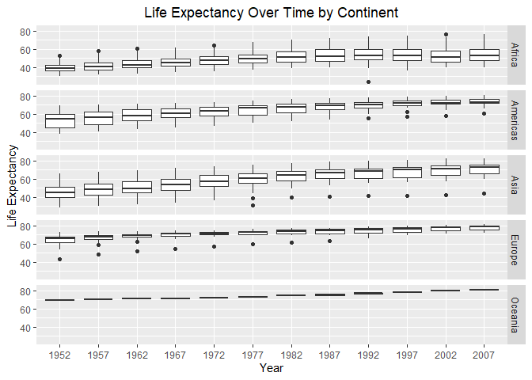

## Instructions
Answer the following questions and complete the exercises in RMarkdown. Please embed all of your code and push your final work to your repository. Your final lab report should be organized, clean, and run free from errors. Remember, you must remove the `#` for the included code chunks to run. Be sure to add your name to the author header above. For any included plots, make sure they are clearly labeled. You are free to use any plot type that you feel best communicates the results of your analysis.  

**In this homework, you should make use of the aesthetics you have learned. It's OK to be flashy!**

Make sure to use the formatting conventions of RMarkdown to make your report neat and clean!  

## Load the libraries

```r
library(tidyverse)
library(janitor)
library(here)
library(naniar)
```


```r
options(scipen = 999)
```

## Resources
The idea for this assignment came from [Rebecca Barter's](http://www.rebeccabarter.com/blog/2017-11-17-ggplot2_tutorial/) ggplot tutorial so if you get stuck this is a good place to have a look.  

## Gapminder
For this assignment, we are going to use the dataset [gapminder](https://cran.r-project.org/web/packages/gapminder/index.html). Gapminder includes information about economics, population, and life expectancy from countries all over the world. You will need to install it before use. This is the same data that we will use for midterm 2 so this is good practice.

```r
#install.packages("gapminder")
library("gapminder")
```

## Questions
The questions below are open-ended and have many possible solutions. Your approach should, where appropriate, include numerical summaries and visuals. Be creative; assume you are building an analysis that you would ultimately present to an audience of stakeholders. Feel free to try out different `geoms` if they more clearly present your results.  

**1. Use the function(s) of your choice to get an idea of the overall structure of the data frame, including its dimensions, column names, variable classes, etc. As part of this, determine how NAs are treated in the data.**  

```r
glimpse(gapminder)
```

```
## Rows: 1,704
## Columns: 6
## $ country   <fct> "Afghanistan", "Afghanistan", "Afghanistan", "Afghanistan", …
## $ continent <fct> Asia, Asia, Asia, Asia, Asia, Asia, Asia, Asia, Asia, Asia, …
## $ year      <int> 1952, 1957, 1962, 1967, 1972, 1977, 1982, 1987, 1992, 1997, …
## $ lifeExp   <dbl> 28.801, 30.332, 31.997, 34.020, 36.088, 38.438, 39.854, 40.8…
## $ pop       <int> 8425333, 9240934, 10267083, 11537966, 13079460, 14880372, 12…
## $ gdpPercap <dbl> 779.4453, 820.8530, 853.1007, 836.1971, 739.9811, 786.1134, …
```

```r
#there don't seem to be any NAs
```

**2. Among the interesting variables in gapminder is life expectancy. How has global life expectancy changed between 1952 and 2007?**

```r
gapminder %>%
  group_by(year) %>%
  summarize(mean_life_exp = mean(lifeExp))
```

```
## # A tibble: 12 × 2
##     year mean_life_exp
##    <int>         <dbl>
##  1  1952          49.1
##  2  1957          51.5
##  3  1962          53.6
##  4  1967          55.7
##  5  1972          57.6
##  6  1977          59.6
##  7  1982          61.5
##  8  1987          63.2
##  9  1992          64.2
## 10  1997          65.0
## 11  2002          65.7
## 12  2007          67.0
```


```r
gapminder %>%
  group_by(year) %>%
  summarize(mean_life_exp = mean(lifeExp)) %>%
  ggplot(aes(x = year, y = mean_life_exp))+
  geom_point()+
  geom_smooth(method = lm, se = T)+
  labs(title = "Life Expectancy Over Time", x = "Year", y = "Mean Global Life Expectancy")+
  theme(plot.title=element_text(size=rel(1.5), hjust=.5))
```

```
## `geom_smooth()` using formula = 'y ~ x'
```

<!-- -->


**3. How do the distributions of life expectancy compare for the years 1952 and 2007?**

```r
gapminder %>%
  group_by(year) %>%
  filter(year == "1952" | year == "2007") %>%
    summarize(min_life_exp = min(lifeExp),
            mean_life_exp = mean(lifeExp),
            max_life_exp = max(lifeExp))
```

```
## # A tibble: 2 × 4
##    year min_life_exp mean_life_exp max_life_exp
##   <int>        <dbl>         <dbl>        <dbl>
## 1  1952         28.8          49.1         72.7
## 2  2007         39.6          67.0         82.6
```


```r
gapminder %>%
  filter(year == "1952" | year == "2007") %>%
  mutate(year=as.factor(year)) %>%
  ggplot(aes(x = year, y = lifeExp))+
  geom_boxplot()+
  labs(title = "Life Expectancy Distributions", x = "Year", y = "Life Expectancy")+
  theme(plot.title=element_text(size=rel(1.5), hjust=.5))
```

<!-- -->


**4. Your answer above doesn't tell the whole story since life expectancy varies by region. Make a summary that shows the min, mean, and max life expectancy by continent for all years represented in the data.**

```r
gapminder %>%
  group_by(continent) %>%
  summarize(min_life_exp = min(lifeExp),
            mean_life_exp = mean(lifeExp),
            max_life_exp = max(lifeExp))
```

```
## # A tibble: 5 × 4
##   continent min_life_exp mean_life_exp max_life_exp
##   <fct>            <dbl>         <dbl>        <dbl>
## 1 Africa            23.6          48.9         76.4
## 2 Americas          37.6          64.7         80.7
## 3 Asia              28.8          60.1         82.6
## 4 Europe            43.6          71.9         81.8
## 5 Oceania           69.1          74.3         81.2
```


```r
gapminder %>%
  ggplot(aes(x = continent, y = lifeExp))+
  geom_boxplot()+
  labs(title = "Life Expectancy By Continent", x = "Continent", y = "Life Expectancy")+
  theme(plot.title=element_text(size=rel(1.5), hjust=.5))
```

<!-- -->

**5. How has life expectancy changed between 1952-2007 for each continent?**

```r
gapminder %>%
  group_by(continent, year) %>%
  summarize(mean_life_exp = mean(lifeExp), .groups = 'keep') %>%
  ggplot(aes(x = year, y = mean_life_exp))+
  geom_point(aes(group = continent, color = continent))+
  geom_smooth(aes(group = continent, color = continent), method = lm, se=F)+
  labs(title = "Life Expectancy Over Time", x = "Year", y = "Mean Life Expectancy", color = "Continent")+
  theme(plot.title = element_text(size = rel(1.5), hjust = 0.5))
```

```
## `geom_smooth()` using formula = 'y ~ x'
```

<!-- -->

**6. We are interested in the relationship between per capita GDP and life expectancy; i.e. does having more money help you live longer?**

```r
gapminder %>%
  ggplot(aes(x = gdpPercap, y = lifeExp))+
  geom_point(size = 0.5)+
  scale_x_log10()+
  geom_smooth(method = lm, se=T)+
  labs(title = "GDP per Capita and Life Expectancy", x = "GDP per Capita (scaled log10)", y = "Life Expectancy")+
  theme(plot.title = element_text(size = rel(1.5), hjust = 0.5))
```

```
## `geom_smooth()` using formula = 'y ~ x'
```

<!-- -->

```r
# there seems to be a logarithmic relationship between per capita GDP and life expectancy
```

**7. Which countries have had the largest population growth since 1952?**

```r
gapminder %>%
  group_by(country) %>%
  filter(year == "1952" | year == "2007")%>%
  select(country, year, pop) %>%
  pivot_wider(names_from = year, names_prefix = "yr_", values_from = pop) %>%
  mutate(pop_growth = yr_2007 - yr_1952) %>%
  arrange(-pop_growth)
```

```
## # A tibble: 142 × 4
## # Groups:   country [142]
##    country         yr_1952    yr_2007 pop_growth
##    <fct>             <int>      <int>      <int>
##  1 China         556263527 1318683096  762419569
##  2 India         372000000 1110396331  738396331
##  3 United States 157553000  301139947  143586947
##  4 Indonesia      82052000  223547000  141495000
##  5 Brazil         56602560  190010647  133408087
##  6 Pakistan       41346560  169270617  127924057
##  7 Bangladesh     46886859  150448339  103561480
##  8 Nigeria        33119096  135031164  101912068
##  9 Mexico         30144317  108700891   78556574
## 10 Philippines    22438691   91077287   68638596
## # ℹ 132 more rows
```

**8. Use your results from the question above to plot population growth for the top five countries since 1952.**

```r
gapminder %>%
  group_by(country) %>%
  filter(year == "1952" | year == "2007")%>%
  select(country, year, pop) %>%
  pivot_wider(names_from = year, names_prefix = "yr_", values_from = pop) %>%
  summarize(pop_growth = yr_2007 - yr_1952) %>%
  top_n(5, pop_growth)
```

```
## # A tibble: 5 × 2
##   country       pop_growth
##   <fct>              <int>
## 1 Brazil         133408087
## 2 China          762419569
## 3 India          738396331
## 4 Indonesia      141495000
## 5 United States  143586947
```


```r
gapminder %>%
  group_by(country) %>%
  filter(year == "1952" | year == "2007")%>%
  select(country, year, pop) %>%
  pivot_wider(names_from = year, names_prefix = "yr_", values_from = pop) %>%
  summarize(pop_growth = yr_2007 - yr_1952) %>%
  top_n(5, pop_growth) %>%
  ggplot(aes(x = country, -pop_growth, y = pop_growth))+
  geom_col()+
  labs(title = "Largest Population Growths", x = "Country", y = "Population Growth from 1952-2007")+
  theme(plot.title = element_text(size = rel(1.5), hjust = 0.5))
```

<!-- -->

**9. How does per capita GDP growth compare between these same five countries?**

```r
gapminder %>%
  group_by(country) %>%
  filter(country == "China" | country == "India" | country == "United States" | country == "Indonesia" | country == "Brazil") %>%
  filter(year == "1952" | year == "2007") %>%
  select(country, year, gdpPercap) %>%
  pivot_wider(names_from = year, names_prefix = "yr_", values_from = gdpPercap) %>%
  summarize(gdp_growth = yr_2007 - yr_1952) %>%
  arrange(gdp_growth)
```

```
## # A tibble: 5 × 2
##   country       gdp_growth
##   <fct>              <dbl>
## 1 India              1906.
## 2 Indonesia          2791.
## 3 China              4559.
## 4 Brazil             6957.
## 5 United States     28961.
```

```r
gapminder %>%
  group_by(country) %>%
  filter(country == "China" | country == "India" | country == "United States" | country == "Indonesia" | country == "Brazil") %>%
  filter(year == "1952" | year == "2007") %>%
  select(country, year, gdpPercap) %>%
  pivot_wider(names_from = year, names_prefix = "yr_", values_from = gdpPercap) %>%
  summarize(gdp_growth = yr_2007 - yr_1952) %>%
  ggplot(aes(x = country, y = gdp_growth))+
  geom_col()+
  labs(title = "GDP Growth (5 Largest Population Growth)", x = "Country", y = "GDP Growth from 1952-2007")+
  theme(plot.title = element_text(size = rel(1.25), hjust = 0.5))
```

<!-- -->

**10. Make one plot of your choice that uses faceting!**

```r
gapminder %>%
  mutate(year = as.factor(year)) %>%
  ggplot(aes(x = year, y = lifeExp))+
  geom_boxplot()+
  facet_grid(continent~.)+
  labs(title = "Life Expectancy Over Time by Continent", x = "Year", y = "Life Expectancy")+
  theme(plot.title = element_text(size = rel(1.25), hjust = 0.5))
```

<!-- -->


## Push your final code to GitHub!
Please be sure that you check the `keep md` file in the knit preferences. 
