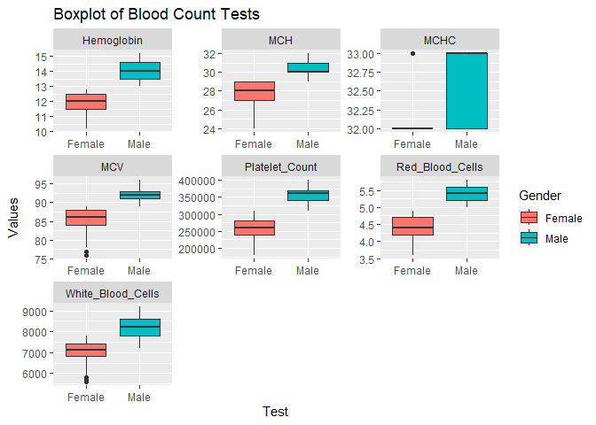
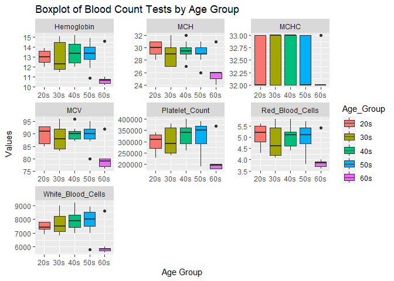

## Instructions
This homework is a bit less traditional this week. There are some errors in the code below. In addition add notes and titles to the code chunks that explains what the code chunk does. Use AI tools, notes from class, or any other resources to help fix the errors. Feel free to edit any plots to your preference. Don't forget to answer the two questions at the bottom. Upon completion, you should not have to '#' out any of the code chunks.

Push your final work to your repository. Your final lab report should be organized, clean, and run free from errors. Remember, you must remove the `#` for the included code chunks to run. Be sure to add your name to the author header above.   

Again make sure to use the formatting conventions of RMarkdown to make your report neat and clean!  


```r
library(tidyverse)
```

```
## ── Attaching core tidyverse packages ──────────────────────── tidyverse 2.0.0 ──
## ✔ dplyr     1.1.4     ✔ readr     2.1.4
## ✔ forcats   1.0.0     ✔ stringr   1.5.1
## ✔ ggplot2   3.4.4     ✔ tibble    3.2.1
## ✔ lubridate 1.9.3     ✔ tidyr     1.3.0
## ✔ purrr     1.0.2     
## ── Conflicts ────────────────────────────────────────── tidyverse_conflicts() ──
## ✖ dplyr::filter() masks stats::filter()
## ✖ dplyr::lag()    masks stats::lag()
## ℹ Use the conflicted package (<http://conflicted.r-lib.org/>) to force all conflicts to become errors
```

```r
library(janitor)
```

```
## 
## Attaching package: 'janitor'
## 
## The following objects are masked from 'package:stats':
## 
##     chisq.test, fisher.test
```

```r
library(dplyr)
```


1.

```r
blood_count <- read_csv("data/blood_count_dataset.csv") #reads the data - added "_dataset" to match actual .csv file
```

```
## Rows: 417 Columns: 9
## ── Column specification ────────────────────────────────────────────────────────
## Delimiter: ","
## chr (1): Gender
## dbl (8): Age, Hemoglobin, Platelet_Count, White_Blood_Cells, Red_Blood_Cells...
## 
## ℹ Use `spec()` to retrieve the full column specification for this data.
## ℹ Specify the column types or set `show_col_types = FALSE` to quiet this message.
```

2. 

```r
glimpse(blood_count) #gives an idea of what the data looks like
```

```
## Rows: 417
## Columns: 9
## $ Age               <dbl> 68, 25, 57, 28, 38, 47, 37, 30, 35, 22, 41, 34, 40, …
## $ Gender            <chr> "Female", "Male", "Male", "Female", "Male", "Female"…
## $ Hemoglobin        <dbl> 10.4, 13.8, 13.5, 12.7, 14.9, 12.0, 14.5, 11.8, 11.5…
## $ Platelet_Count    <dbl> 180000, 320000, 370000, 290000, 380000, 260000, 3800…
## $ White_Blood_Cells <dbl> 5700, 7500, 8500, 7800, 8700, 7000, 8700, 7000, 7100…
## $ Red_Blood_Cells   <dbl> 3.7, 5.4, 5.1, 4.8, 5.7, 4.4, 5.7, 4.2, 4.2, 5.6, 4.…
## $ MCV               <dbl> 77, 92, 90, 86, 95, 87, 95, 84, 84, 93, 88, 85, 96, …
## $ MCH               <dbl> 25, 30, 29, 29, 31, 28, 31, 27, 27, 31, 29, 28, 32, …
## $ MCHC              <dbl> 32, 32, 32, 33, 33, 32, 33, 32, 32, 32, 33, 32, 33, …
```

3. 

```r
blood_count %>% 
  group_by(Gender) %>% #groups by gender (capitalize G)
  summarize(min=min(Red_Blood_Cells), # creates summary columns of min, mean, and max of RBC count
            mean=mean(Red_Blood_Cells),
            max=max(Red_Blood_Cells))
```

```
## # A tibble: 2 × 4
##   Gender   min  mean   max
##   <chr>  <dbl> <dbl> <dbl>
## 1 Female   3.6  4.36   4.9
## 2 Male     5    5.38   5.8
```


4.


```r
options(scipen = 999) #cancels scientific notation
```


```r
blood_count %>% 
  filter(Gender == "Male") %>% # limits blood count values for Males only
  select(3:9) %>%
  colMeans(na.rm = TRUE) #ignores NAs and calculates means of blood count values (columnt 3 through 9)
```

```
##        Hemoglobin    Platelet_Count White_Blood_Cells   Red_Blood_Cells 
##         14.034450     355598.086124       8184.688995          5.383254 
##               MCV               MCH              MCHC 
##         92.334928         30.363636         32.578947
```

5. 

```r
blood_count %>% 
  filter(Gender == "Female") %>%
  select(3:9) %>%
  colMeans(na.rm = T)
```

```
##        Hemoglobin    Platelet_Count White_Blood_Cells   Red_Blood_Cells 
##         11.878846     255913.461538       6967.788462          4.362019 
##               MCV               MCH              MCHC 
##         84.903846         27.653846         32.240385
```

```r
# same as 4 but for Females
```


6. 

```r
blood_count %>%
  pivot_longer(cols = (3:9), names_to = "Test", values_to = "Values") %>% #pivots *longer*
  ggplot(aes(x = Gender, y = Values, fill = Gender)) + # take Gender and new column "Values", colors in by gender
  geom_boxplot() + #creates boxplot
  facet_wrap(~ Test, scales = "free")+ #wrap by "Test" (new names)
  labs(title = "Boxplot of Blood Count Tests", # labels plot
       x = "Test",
       y = "Values")
```

<!-- -->

7. 

```r
grouped_bc <- blood_count %>% #creates a new dataframe called grouped_bc
  mutate(Age_Group = case_when( #mutate to add a new column to the data frame called "Age_Group"
    Age >= 20 & Age <= 29 ~ "20s", # when Age is in specified range, the Age_Group value gets ~ "[insert group]"
    Age >= 30 & Age <= 39 ~ "30s",
    Age >= 40 & Age <= 49 ~ "40s",
    Age >= 50 & Age <= 59 ~ "50s",
    Age >= 60 & Age <= 70 ~ "60s")) # there were only 4 people in 70s, so I combined it with 60s

head(grouped_bc)
```

```
## # A tibble: 6 × 10
##     Age Gender Hemoglobin Platelet_Count White_Blood_Cells Red_Blood_Cells   MCV
##   <dbl> <chr>       <dbl>          <dbl>             <dbl>           <dbl> <dbl>
## 1    68 Female       10.4         180000              5700             3.7    77
## 2    25 Male         13.8         320000              7500             5.4    92
## 3    57 Male         13.5         370000              8500             5.1    90
## 4    28 Female       12.7         290000              7800             4.8    86
## 5    38 Male         14.9         380000              8700             5.7    95
## 6    47 Female       12           260000              7000             4.4    87
## # ℹ 3 more variables: MCH <dbl>, MCHC <dbl>, Age_Group <chr>
```

8. 

```r
grouped_bc %>% #takes from new dataframe with Age_Group column
  pivot_longer(cols = 3:9, names_to = "Test", values_to = "Values") %>% #pivots longer for blood count variables
  ggplot(aes(x = Age_Group, y = Values, fill = Age_Group)) + # similar to previous boxplot, but by colors by age group
  geom_boxplot() +
  facet_wrap(~Test, scales = "free") +  # Facet by the "Test" variable - allows scales to be different for each plot
  labs(title = "Boxplot of Blood Count Tests by Age Group",
       x = "Age Group",
       y = "Values")
```

<!-- -->


9. What are two drawbacks and two benefits of AI?\

Some drawbacks are that we can become too dependent on AI and not have a deep understanding. Also, AI doesn't always understand what you are asking of it. On the other hand, AI is much faster than humans, so it can code and troubleshoot much faster than humans, plus it has all the syntax memorized and can help when as a quick reference.

10. Do you think you will use AI for coding in the future? Why or why not?\

Yes, when I get stuck I think AI will be helpful. However, I want to prevent becoming too reliant on AI.

## Push your final code to GitHub!
Please be sure that you check the `keep md` file in the knit preferences. 
