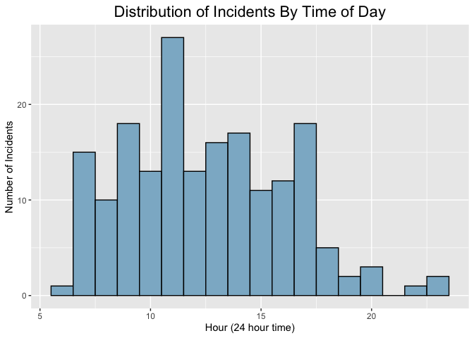

## Instructions

Answer the following questions and complete the exercises in RMarkdown. Please embed all of your code and push your final work to your repository. Your code must be organized, clean, and run free from errors. Remember, you must remove the `#` for any included code chunks to run. Be sure to add your name to the author header above.

Your code must knit in order to be considered. If you are stuck and cannot answer a question, then comment out your code and knit the document. You may use your notes, labs, and homework to help you complete this exam. Do not use any other resources- including AI assistance.

Don't forget to answer any questions that are asked in the prompt. Some questions will require a plot, but others do not- make sure to read each question carefully.

For the questions that require a plot, make sure to have clearly labeled axes and a title. Keep your plots clean and professional-looking, but you are free to add color and other aesthetics.

Be sure to follow the directions and upload your exam on Gradescope.

## Background

In the `data` folder, you will find data about shark incidents in California between 1950-2022. The [data](https://catalog.data.gov/dataset/shark-incident-database-california-56167) are from: State of California- Shark Incident Database.

## Load the libraries


```r
library("tidyverse")
library("janitor")
library("naniar")
```

## Load the data

Run the following code chunk to import the data.


```r
sharks <- read_csv("data/SharkIncidents_1950_2022_220302.csv") %>% clean_names()
```

## Questions

1.  (1 point) Start by doing some data exploration using your preferred function(s). What is the structure of the data? Where are the missing values and how are they represented?\


```r
glimpse(sharks)
```

```
## Rows: 211
## Columns: 16
## $ incident_num     <chr> "1", "2", "3", "4", "5", "6", "7", "8", "9", "10", "1…
## $ month            <dbl> 10, 5, 12, 2, 8, 4, 10, 5, 6, 7, 10, 11, 4, 5, 5, 8, …
## $ day              <dbl> 8, 27, 7, 6, 14, 28, 12, 7, 14, 28, 4, 10, 24, 19, 21…
## $ year             <dbl> 1950, 1952, 1952, 1955, 1956, 1957, 1958, 1959, 1959,…
## $ time             <chr> "12:00", "14:00", "14:00", "12:00", "16:30", "13:30",…
## $ county           <chr> "San Diego", "San Diego", "Monterey", "Monterey", "Sa…
## $ location         <chr> "Imperial Beach", "Imperial Beach", "Lovers Point", "…
## $ mode             <chr> "Swimming", "Swimming", "Swimming", "Freediving", "Sw…
## $ injury           <chr> "major", "minor", "fatal", "minor", "major", "fatal",…
## $ depth            <chr> "surface", "surface", "surface", "surface", "surface"…
## $ species          <chr> "White", "White", "White", "White", "White", "White",…
## $ comment          <chr> "Body Surfing, bit multiple times on leg, thigh and b…
## $ longitude        <chr> "-117.1466667", "-117.2466667", "-122.05", "-122.15",…
## $ latitude         <dbl> 32.58833, 32.58833, 36.62667, 36.62667, 35.13833, 35.…
## $ confirmed_source <chr> "Miller/Collier, Coronado Paper, Oceanside Paper", "G…
## $ wfl_case_number  <chr> NA, NA, NA, NA, NA, NA, NA, NA, NA, NA, NA, NA, NA, N…
```

```r
#I see an "Unknown" under time/species and "NOT COUNTED" under incident_num
```


```r
summary(sharks)
```

```
##  incident_num           month             day             year     
##  Length:211         Min.   : 1.000   Min.   : 1.00   Min.   :1950  
##  Class :character   1st Qu.: 6.000   1st Qu.: 7.50   1st Qu.:1985  
##  Mode  :character   Median : 8.000   Median :18.00   Median :2004  
##                     Mean   : 7.858   Mean   :16.54   Mean   :1998  
##                     3rd Qu.:10.000   3rd Qu.:25.00   3rd Qu.:2014  
##                     Max.   :12.000   Max.   :31.00   Max.   :2022  
##                                                                    
##      time              county            location             mode          
##  Length:211         Length:211         Length:211         Length:211        
##  Class :character   Class :character   Class :character   Class :character  
##  Mode  :character   Mode  :character   Mode  :character   Mode  :character  
##                                                                             
##                                                                             
##                                                                             
##                                                                             
##     injury             depth             species            comment         
##  Length:211         Length:211         Length:211         Length:211        
##  Class :character   Class :character   Class :character   Class :character  
##  Mode  :character   Mode  :character   Mode  :character   Mode  :character  
##                                                                             
##                                                                             
##                                                                             
##                                                                             
##   longitude            latitude     confirmed_source   wfl_case_number   
##  Length:211         Min.   :32.59   Length:211         Length:211        
##  Class :character   1st Qu.:34.04   Class :character   Class :character  
##  Mode  :character   Median :36.70   Mode  :character   Mode  :character  
##                     Mean   :36.36                                        
##                     3rd Qu.:38.18                                        
##                     Max.   :41.56                                        
##                     NA's   :6
```

2.  (1 point) Notice that there are some incidents identified as "NOT COUNTED". These should be removed from the data because they were either not sharks, unverified, or were provoked. It's OK to replace the `sharks` object.


```r
sharks <- sharks %>%
  replace_with_na(replace = list(incident_num = "NOT COUNTED",
                                 time = "Unknown",
                                 species = "Unknown"))
```


```r
sharks <- sharks %>%
  filter(incident_num != "NA")
```


3.  (3 points) Are there any "hotspots" for shark incidents in California? Make a plot that shows the total number of incidents per county. Which county has the highest number of incidents?\
San Diego has the highest number of incidents.


```r
sharks %>%
  ggplot(aes(x = county))+
  geom_bar()+
  coord_flip()+
  labs(title = "Incidents by County", x = "County", y = "Count")+
  theme(plot.title=element_text(size=rel(1.5), hjust=.5))
```

<!-- -->

4.  (3 points) Are there months of the year when incidents are more likely to occur? Make a plot that shows the total number of incidents by month. Which month has the highest number of incidents?\
October has the highest number of incidents.


```r
sharks%>%
  mutate(month = as.factor(month)) %>%
  ggplot(aes(x = month))+
  geom_bar()+
  labs(title = "Incidents by Month", x = "Month", y = "Count")+
  theme(plot.title=element_text(size=rel(1.5), hjust=.5))
```

<!-- -->

5.  (3 points) How do the number and types of injuries compare by county? Make a table (not a plot) that shows the number of injury types by county. Which county has the highest number of fatalities?\
San Luis Obispo has the highest number of fatalities - 3.


```r
sharks %>%
  group_by(county, injury) %>%
  summarize(count = n(), .groups = 'keep')
```

```
## # A tibble: 57 × 3
## # Groups:   county, injury [57]
##    county              injury count
##    <chr>               <chr>  <int>
##  1 Del Norte           minor      2
##  2 Del Norte           none       1
##  3 Humboldt            major      7
##  4 Humboldt            minor      2
##  5 Humboldt            none       9
##  6 Island - Catalina   minor      1
##  7 Island - Catalina   none       3
##  8 Island - Farallones major      7
##  9 Island - San Miguel fatal      1
## 10 Island - San Miguel major      2
## # ℹ 47 more rows
```


```r
sharks %>%
  group_by(county, injury) %>%
  summarize(count = n(), .groups = 'keep') %>%
  filter(injury == "fatal") %>%
  arrange(-count)
```

```
## # A tibble: 10 × 3
## # Groups:   county, injury [10]
##    county              injury count
##    <chr>               <chr>  <int>
##  1 San Luis Obispo     fatal      3
##  2 Monterey            fatal      2
##  3 San Diego           fatal      2
##  4 Santa Barbara       fatal      2
##  5 Island - San Miguel fatal      1
##  6 Los Angeles         fatal      1
##  7 Mendocino           fatal      1
##  8 San Francisco       fatal      1
##  9 San Mateo           fatal      1
## 10 Santa Cruz          fatal      1
```

6.  (2 points) In the data, `mode` refers to a type of activity. Which activity is associated with the highest number of incidents?\
Surfing / Boarding is assiciated with the highest number of incidents at 80.


```r
sharks %>%
  group_by(mode) %>%
  summarize(incidents = n()) %>%
  arrange(-incidents)
```

```
## # A tibble: 7 × 2
##   mode                incidents
##   <chr>                   <int>
## 1 Surfing / Boarding         80
## 2 Freediving                 35
## 3 Kayaking / Canoeing        29
## 4 Swimming                   22
## 5 Scuba Diving               19
## 6 Hookah Diving              10
## 7 Paddleboarding              7
```

7.  (4 points) Use faceting to make a plot that compares the number and types of injuries by activity. (hint: the x axes should be the type of injury)


```r
sharks %>%
  ggplot(aes(x = injury))+
  geom_bar()+
  facet_wrap(~mode)+
  labs(title = "Injuries by Activity", x = "Injury Type", y = "Count")+
  theme(axis.text.x = element_text(angle = 60, hjust=1),
        plot.title=element_text(size=rel(1.5), hjust=.5))
```

<!-- -->

8.  (1 point) Which shark species is involved in the highest number of incidents?\


```r
sharks %>%
  group_by(species) %>%
  summarize(incidents = n()) %>%
  filter(incidents == max(incidents))
```

```
## # A tibble: 1 × 2
##   species incidents
##   <chr>       <int>
## 1 White         179
```

9.  (3 points) Are all incidents involving Great White's fatal? Make a plot that shows the number and types of injuries for Great White's only.\
No, the majority of incidents have no injuries.

```r
sharks %>%
  filter(species == "White") %>%
  ggplot(aes(x = injury))+
  geom_bar()+
  labs(title = "Great White Injuries", x = "Injury Type", y = "Count")+
  theme(plot.title=element_text(size=rel(1.5), hjust=.5))
```

<!-- -->

## Background

Let's learn a little bit more about Great White sharks by looking at a small dataset that tracked 20 Great White's in the Fallaron Islands. The [data](https://link.springer.com/article/10.1007/s00227-007-0739-4) are from: Weng et al. (2007) Migration and habitat of white sharks (*Carcharodon carcharias*) in the eastern Pacific Ocean.

## Load the data


```r
white_sharks <- read_csv("data/White sharks tracked from Southeast Farallon Island, CA, USA, 1999 2004.csv", na = c("?", "n/a")) %>% clean_names()
```

10. (1 point) Start by doing some data exploration using your preferred function(s). What is the structure of the data? Where are the missing values and how are they represented?\
The NAs are already NA, but the shark column includes the variable 'sex', so some are labeled with a number and "U" instead of M or F - this is redundant


```r
glimpse(white_sharks)
```

```
## Rows: 20
## Columns: 10
## $ shark           <chr> "1-M", "2-M", "3-M", "4-M", "5-F", "6-M", "7-F", "8-M"…
## $ tagging_date    <chr> "19-Oct-99", "30-Oct-99", "16-Oct-00", "5-Nov-01", "5-…
## $ total_length_cm <dbl> 402, 366, 457, 457, 488, 427, 442, 380, 450, 530, 427,…
## $ sex             <chr> "M", "M", "M", "M", "F", "M", "F", "M", "M", "F", NA, …
## $ maturity        <chr> "Mature", "Adolescent", "Mature", "Mature", "Mature", …
## $ pop_up_date     <chr> "2-Nov-99", "25-Nov-99", "16-Apr-01", "6-May-02", "19-…
## $ track_days      <dbl> 14, 26, 182, 182, 256, 275, 35, 60, 209, 91, 182, 240,…
## $ longitude       <dbl> -124.49, -125.97, -156.80, -141.47, -133.25, -138.83, …
## $ latitude        <dbl> 38.95, 38.69, 20.67, 26.39, 21.13, 26.50, 37.07, 34.93…
## $ comment         <chr> "Nearshore", "Nearshore", "To Hawaii", "To Hawaii", "O…
```

11. (3 points) How do male and female sharks compare in terms of total length? Are males or females larger on average? Do a quick search online to verify your findings. (hint: this is a table, not a plot).\
    Females are larger on average, verified [here](https://ocean.si.edu/ocean-life/sharks-rays/how-big-are-great-white-sharks#:~:text=The%20average%20female%20is%2015,our%20great%20white%20shark%20overview.)


```r
white_sharks %>%
  group_by(sex) %>%
  summarize(mean_length = mean(total_length_cm))
```

```
## # A tibble: 3 × 2
##   sex   mean_length
##   <chr>       <dbl>
## 1 F            462 
## 2 M            425.
## 3 <NA>         425
```

12. (3 points) Make a plot that compares the range of total length by sex.

```r
white_sharks %>%
  filter(sex!= "NA") %>%
  ggplot(aes(x = sex, y = total_length_cm))+
  geom_boxplot()+
  labs(title = "Length Distribution by Sex", x = "Sex", y = "Length (cm)")+
  theme(plot.title = element_text(size = rel(1.5), hjust = 0.5))
```

<!-- -->


13. (2 points) Using the `sharks` or the `white_sharks` data, what is one question that you are interested in exploring? Write the question and answer it using a plot or table.\
Is there a time of day in which most incidents occur?


```r
sharks %>%
  filter(time != "NA", time != "early am", time != "afternoon") %>% #get rid of poorly represented/unknown times
  separate(time, into = c("hour", "minute"), sep = ":") %>%
  mutate(hour = as.numeric(hour)) %>%
  ggplot(aes(x = hour))+
  geom_histogram(color = "black", fill = "lightskyblue3", binwidth = 1)+
  labs(title = "Distribution of Incidents By Time of Day", x = "Hour (24 hour time)", y = "Number of Incidents")+
  theme(plot.title = element_text(size = rel(1.5), hjust = 0.5))
```

<!-- -->

